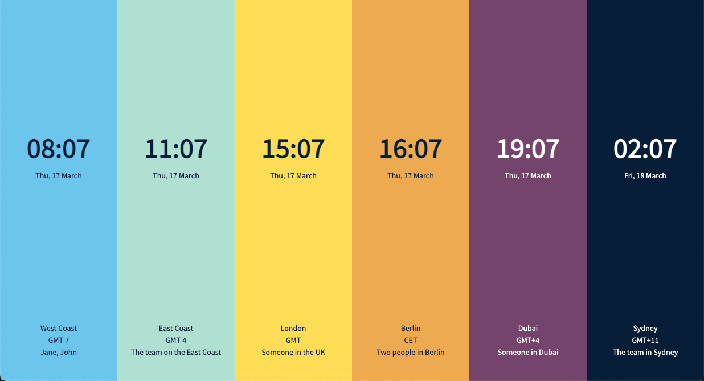

# Follow the Sun

This is a tool I built for our global team to see immediately what time it is for everyone on the team. The background colors for each clock give a visual indication of the time of day: 

The page is responsive and will display the timezones horizontally on mobile. 

Here's how to use it: 
1. supply your data to the `timeZones` object at the top of the `clocks.js` file
2. host all the files in the same directory and open the `clocks.html` page. 

The `timeZones` object contains the timezones you want to display. You specify
- the timezone, using the [tz database name](https://en.wikipedia.org/wiki/List_of_tz_database_time_zones), e.g. `"America/Los_Angeles"`
- the name you want to give to this timezone, e.g. `"West Coast"`
- the team members working in this timezone, e.g. `"Jane, John"`. If you don't want to display the names of people in your team, use an empty string here. 

Make sure to index the first timezone with 0, not 1. 

Note also that the script doesn't order the timezones automatically, it just iterates over the `timeZones` object, so make sure to arrange your data in the order you prefer. 

You can have up to 10 timezones and it should still look good on a laptop screen, as long as you don't have too many people per timezone. Anything above that can still work but depends on the screen size. 

The `timeZones` object for the image above can be found in the `clocks.js` script to get started. 

Any feedback, feel free to let me know! 